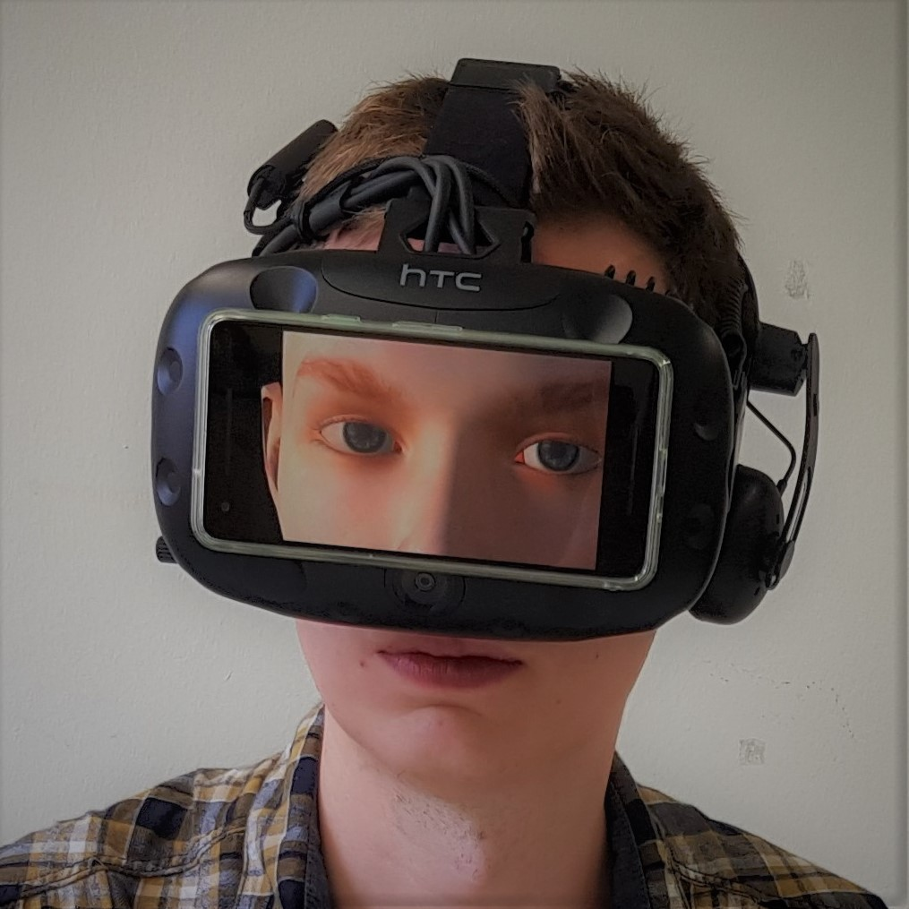
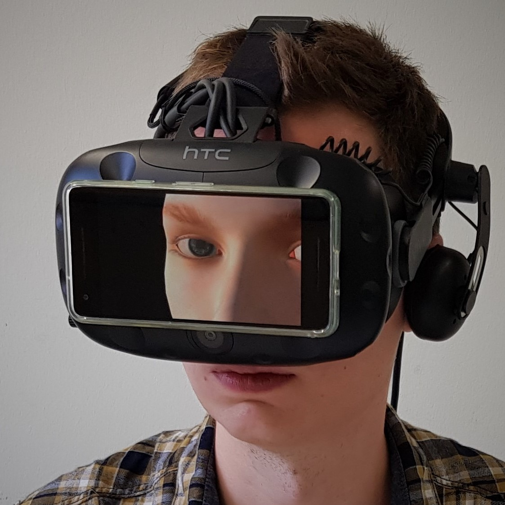

### HMDDisplay

Unity3D project developedas part of my Master Thesis. This prototype shows a 3D model of a face on a screen attached to the outside of a head-mounted display and was used in the user study of the thesis.

 

### Key Features

- Displays 3D model of face to make HMD appear see-through
- Eye movements simulate gaze cues
- Front camera tracks interlocutor to direct gaze at him or her
- Camera projection matrix adjusts to interlocutor's position
- Gaze cues able to be remote controlled using [HMDBluetoothControls](https://github.com/alex-kn/HMDBluetoothControls)
